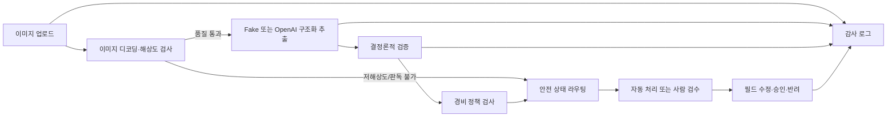

# AI 영수증·경비 검수 시스템

비전 LLM의 결과를 그대로 승인하지 않고, 결정론적 규칙과 사람 검수 안에서 안전하게 사용하는 백엔드 MVP입니다. 선명한 한국어 카드 영수증 한 장을 업로드하면 `merchant`, `date`, `totalAmount` 중심의 구조화 데이터를 제안하고, 규칙 엔진이 최종 처리 경로를 결정합니다.

## 핵심 원칙

- AI는 값을 제안할 뿐 승인·반려를 결정하지 않습니다.
- 읽을 수 없는 값은 추측하지 않고 `null`로 취급합니다.
- 모델이 스스로 만든 confidence 숫자는 판단에 사용하지 않습니다.
- 원본 추출값, 검수 수정값, 규칙 결과, 상태 변경을 감사 이벤트로 남깁니다.
- 실제 영수증, 개인정보, API 키는 저장소에 커밋하지 않습니다.
- MVP는 이미지 원본을 영속 저장하지 않고 SHA-256과 파일 메타데이터만 저장합니다.

## 기술 스택

- Java 21, Spring Boot 3.3, Gradle 8
- Spring MVC, Bean Validation, Spring Data JPA, Hibernate
- MySQL 8.4 LTS, Flyway, Redis 7.2, Redisson
- OpenAI Responses API 또는 결정론적 Fake 추출기
- Spring Boot Actuator, Micrometer, Prometheus registry
- JUnit 5, AssertJ, MockMvc, H2, Testcontainers MySQL
- Docker Compose

## 패키지 구조

```text
com.example.receipt
├── api             # REST Controller
│   └── dto         # API 요청·응답 DTO
├── entity          # JPA Entity
├── service         # 업로드·저장·조회·검수 업무 서비스
│   └── model       # 서비스 내부 입력·결과 모델
├── exception       # 업무 예외와 API 예외 응답 처리
├── domain          # enum, 값 객체, 규칙 결과
├── repository      # Spring Data JPA Repository
├── validation      # 결정론적 검증과 상태 라우팅
├── extraction      # Fake/OpenAI 추출기
├── quality         # 이미지 품질 검사
├── concurrency     # 동일 이미지 동시 처리 잠금
└── config          # 애플리케이션 설정
```

현재 프로젝트는 순수 도메인 모델과 JPA 영속 모델을 분리한 구조가 아니므로, JPA 어노테이션을 가진 클래스는 `entity`에 명시적으로 배치했습니다. `domain`에는 DB 저장 방식과 무관한 상태·결정·값 객체만 둡니다.

## 처리 흐름



## 구현된 안전장치

### 중복 제출과 멱등성

- `Idempotency-Key`는 동일 API 요청 재전송 시 중복 처리를 막는 요청 키입니다.
- 이미지 바이트의 SHA-256을 계산합니다.
- `(company_id, image_sha256)` MySQL Unique Constraint가 최종 중복 방어선입니다.
- 동일 이미지를 다시 제출하면 새 레코드를 만들지 않고 기존 건을 `NEEDS_REVIEW`로 전환합니다.
- `Idempotency-Key`가 같으면 기존 응답을 재사용합니다.
- 애플리케이션 선조회는 불필요한 AI 재호출을 줄이지만, 정합성은 DB 제약조건이 보장합니다.
- `(companyId, imageSha256)` 기반 Redisson 분산 락으로 동일 이미지 처리를 직렬화합니다.
- Redis 락 획득 후 MySQL을 다시 조회하며, 최초 요청만 생성하고 후속 요청은 기존 영수증을 중복 처리합니다.
- Redis는 동시 실행을 제어하고 MySQL Unique Constraint는 최종 데이터 정합성을 보장합니다.

### 검수 동시성

- `receipts.version`과 JPA `@Version`으로 낙관적 락을 적용했습니다.
- 수정·결정 요청은 조회한 `version`을 함께 보냅니다.
- 다른 검수자가 먼저 변경했다면 `409 Conflict`를 반환합니다.
- `APPROVED`, `REJECTED` 상태는 다시 수정할 수 없습니다.

### 실패 안전 처리

- 이미지 디코딩 실패: `UNREADABLE`
- 최소 해상도 미달: `NEEDS_RECAPTURE`
- 추출기 오류 또는 핵심 필드 전체 누락: `MANUAL_ENTRY`
- 필수값·금액·날짜·정책·중복 규칙 실패: `NEEDS_REVIEW`
- 모든 규칙 통과: `AUTO_APPROVED`
- 사람 검수 최종 결과: `APPROVED` 또는 `REJECTED`

## 검증 규칙

- 상호, 거래일, 총액 필수 여부
- 미래 거래일
- 0 이하 금액
- 품목 합계와 총액 일치 여부
- 한국 사업자등록번호 형식과 체크섬
- 동일 이미지 중복 제출
- 회사 경비 한도
- 주말 사용
- 금지 상호·업종 키워드

규칙 결과는 `PASS`, `FAIL`, `NOT_APPLICABLE`로 기록됩니다. 선택 필드가 없다는 이유만으로 실패시키지 않고 `NOT_APPLICABLE`로 남깁니다.

## 실행

필수 조건은 JDK 21과 Docker입니다.

```bash
docker compose up -d mysql redis
./gradlew bootRun
```

기본 추출기는 API 키가 필요 없는 `fake`입니다. 애플리케이션 기본 주소는 `http://localhost:8080`입니다.

### OpenAI 추출기 사용

```bash
export RECEIPT_EXTRACTOR_PROVIDER=openai
export OPENAI_API_KEY=your_key_here
export OPENAI_MODEL=gpt-5.4-mini
./gradlew bootRun
```

OpenAI 어댑터는 Responses API 이미지 입력과 strict JSON Schema 구조화 출력을 사용합니다. 구현 기준은 공식 OpenAI 문서의 [Images and vision](https://developers.openai.com/api/docs/guides/images-vision)과 [Structured Outputs](https://developers.openai.com/api/docs/guides/structured-outputs)입니다.

키가 없을 때도 기본 Fake 추출기로 애플리케이션과 전체 테스트를 실행할 수 있습니다. `openai`를 선택했지만 키가 없다면 추출 건은 자동 승인되지 않고 `MANUAL_ENTRY`로 안전하게 전환됩니다.

## API 예시

### 업로드

```bash
curl -i -X POST http://localhost:8080/api/receipts \
  -H 'X-Company-Id: demo-company' \
  -H 'Idempotency-Key: upload-001' \
  -F 'file=@synthetic-receipt.png'
```

### 조회 및 감사 로그

```bash
curl http://localhost:8080/api/receipts/{receiptId}
curl http://localhost:8080/api/receipts/{receiptId}/audit-events
```

### 검수 필드 수정

```bash
curl -X PATCH http://localhost:8080/api/receipts/{receiptId}/fields \
  -H 'Content-Type: application/json' \
  -d '{
    "version": 0,
    "reviewerId": "reviewer-1",
    "merchant": "수정된 상점",
    "date": "2026-01-15",
    "totalAmount": 12000
  }'
```

값을 명시적으로 `null`로 바꾸려면 `clearFields`를 사용합니다.

```json
{
  "version": 1,
  "reviewerId": "reviewer-1",
  "clearFields": ["businessRegistrationNumber"]
}
```

### 승인 또는 반려

```bash
curl -X POST http://localhost:8080/api/receipts/{receiptId}/decision \
  -H 'Content-Type: application/json' \
  -d '{
    "version": 1,
    "reviewerId": "reviewer-1",
    "decision": "APPROVE",
    "note": "증빙 확인 완료"
  }'
```

## Fake 추출 시나리오

Fake 추출기는 파일 내용에 개인정보를 넣지 않고 파일명으로 테스트 시나리오를 선택합니다.

| 파일명 포함 문자열 | 결과 |
|---|---|
| 일반 파일명 | 정상 평일 영수증 |
| `missing-merchant` | 상호 누락 |
| `weekend` | 주말 사용 |
| `over-limit` | 회사 한도 초과 |
| `manual` | 핵심 필드 전체 누락 |
| `extract-fail` | 추출기 오류 |

## 테스트

```bash
./gradlew test
```

테스트 범위:

- 사업자등록번호 체크섬 단위 테스트
- 필수 필드·날짜·금액·경비 정책·상태 라우팅 단위 테스트
- API 키 없는 OpenAI 어댑터 실패 안전 테스트
- 업로드부터 자동 승인까지의 통합 테스트
- 저해상도와 판독 불가 라우팅
- 검수 수정, 승인, 감사 로그
- 오래된 버전을 이용한 수정 충돌
- Idempotency-Key 재전송
- 동일 이미지 중복 제출
- 다중 스레드 동시 제출 시 단일 레코드 수렴
- Testcontainers MySQL 8.4와 Redis 7.2에서 Flyway/JPA 스키마와 실제 분산 락 동시성 검증

## 설정

주요 환경변수는 [.env.example](.env.example)에 정리되어 있습니다. 경비 한도, 해상도, 주말 검수 및 금지 키워드는 [application.yml](src/main/resources/application.yml)에서 변경할 수 있습니다.

## 현재 범위와 다음 단계

현재 구현은 핵심 정합성과 검수 흐름을 우선한 MVP입니다.

- 외부 AI 호출은 현재 요청 내에서 동기 처리됩니다. 다음 단계는 객체 스토리지, 작업 큐, Transactional Outbox를 이용한 내구성 있는 비동기 처리입니다.
- 회사 정책은 설정 파일 기반입니다. 다중 회사 정책을 MySQL에서 관리하게 되면 Redis Cache-Aside, 정책 버전 키, 변경 이벤트 기반 무효화를 추가할 계획입니다.
- 인증·권한은 아직 없습니다. 검수자 역할 기반 접근 제어가 필요합니다.
- 흐림, 잘림, 반사광 검사는 아직 없습니다. OpenCV 도입 전에 평가 데이터와 임계값을 먼저 정의해야 합니다.
- 원본 이미지를 운영에서 저장하려면 암호화된 객체 스토리지, 제한된 보존 기간, 접근 로그와 삭제 정책이 필요합니다.
- Actuator와 Prometheus 레지스트리는 포함했으며, 다음 단계에서 자동 처리율·검수 전환율·재촬영률·처리 시간·모델 비용 지표를 추가합니다.

캐시는 정합성 요구와 무효화 전략이 정의된 데이터에만 적용합니다. 변경이 잦은 영수증 상태를 무조건 캐싱하지 않고, 변경 빈도가 낮은 회사 정책과 사업자 조회 결과를 우선 대상으로 삼습니다.

## 변경 기록

기능, 버그 수정, DB 스키마, 동시성·보안 설계의 변경과 검증 결과는 [CHANGELOG.md](CHANGELOG.md)에 계속 누적합니다.
