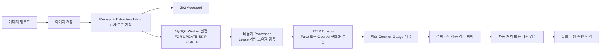

# AI 영수증·경비 검수 시스템

비전 LLM의 결과를 그대로 승인하지 않고, 결정론적 규칙과 사람 검수 안에서 안전하게 사용하는 백엔드 MVP입니다. 선명한 한국어 카드 영수증 한 장을 업로드하면 `merchant`, `date`, `totalAmount` 중심의 구조화 데이터를 제안하고, 규칙 엔진이 최종 처리 경로를 결정합니다.

## 핵심 원칙

- AI는 값을 제안할 뿐 승인·반려를 결정하지 않습니다.
- 읽을 수 없는 값은 추측하지 않고 `null`로 취급합니다.
- 모델이 스스로 만든 confidence 숫자는 판단에 사용하지 않습니다.
- 원본 추출값, 검수 수정값, 규칙 결과, 상태 변경을 감사 이벤트로 남깁니다.
- 실제 영수증, 개인정보, API 키는 저장소에 커밋하지 않습니다.
- 비동기 처리에 필요한 원본은 저장소 포트 뒤에 격리하며, 로컬 개발에서는 Git 제외 경로에 보관합니다. 운영에서는 암호화된 객체 스토리지와 보존·삭제 정책으로 교체해야 합니다.

## 기술 스택

- Java 17, Spring Boot 3.3, Gradle 8
- Spring MVC, Bean Validation, Spring Data JPA, Hibernate
- MySQL 8.4 LTS, Flyway, MySQL 기반 내구성 작업 큐, Redis 7.2, Redisson
- MySQL `RETRY_WAIT` 기반 고정 지연 내구성 재시도
- OpenAI Responses API 또는 결정론적 Fake 추출기
- Spring Boot Actuator, Micrometer, Prometheus, Grafana, k6
- JUnit 5, AssertJ, MockMvc, H2, Testcontainers MySQL
- Docker Compose

## 패키지 구조

```text
com.example.receipt
├── api             # REST Controller
│   └── dto         # API 요청·응답 DTO
├── entity          # JPA Entity
├── service         # 업로드·저장·조회·검수 업무 서비스
│   └── model       # 서비스 내부 입력·결과 모델
├── exception       # 업무 예외와 API 예외 응답 처리
├── domain          # enum, 값 객체, 규칙 결과
├── repository      # Spring Data JPA Repository
├── validation      # 결정론적 검증과 상태 라우팅
├── extraction      # Fake/OpenAI 추출기
├── quality         # 이미지 품질 검사
├── storage         # 비동기 처리를 위한 이미지 저장소 포트와 로컬 구현
├── concurrency     # 동일 이미지 동시 처리 잠금
├── observability   # Micrometer 메트릭과 DB 기반 Job Gauge
└── config          # 애플리케이션 설정
```

현재 프로젝트는 순수 도메인 모델과 JPA 영속 모델을 분리한 구조가 아니므로, JPA 어노테이션을 가진 클래스는 `entity`에 명시적으로 배치했습니다. `domain`에는 DB 저장 방식과 무관한 상태·결정·값 객체만 둡니다.

## 처리 흐름



## 구현된 안전장치

### 내구성 있는 비동기 접수

- 업로드 요청 경로에서는 이미지 품질 검사와 외부 AI를 호출하지 않습니다.
- 이미지 저장이 끝난 뒤 `Receipt`, `ReceiptExtractionJob`, `IdempotencyRecord`, `UPLOADED` 감사 이벤트를 MySQL 한 트랜잭션으로 저장합니다.
- 최초 접수는 `202 Accepted`와 `receiptId`, `jobId`, `jobStatus=QUEUED`를 반환합니다.
- 처리 전에는 영수증 업무 상태 `status`가 `null`이고, 기술 상태는 별도 `jobStatus`가 나타냅니다.
- Scheduler가 실행 가능한 Job을 주기적으로 찾고, MySQL `SELECT ... FOR UPDATE SKIP LOCKED`로 여러 Worker가 서로 기다리거나 같은 행을 중복 선점하지 않게 합니다.
- 고정 크기 Executor와 Semaphore로 인스턴스별 외부 AI 동시 호출 수를 제한합니다.
- Job 선점 시 `workerId`, 매번 새로 발급하는 `claimToken`, `leaseUntil`을 기록합니다. 완료 트랜잭션은 이 소유권이 현재도 유효할 때만 Receipt와 Job 결과를 함께 반영합니다.
- Worker가 종료되어 `PROCESSING`에 남은 Job은 Lease 만료 후 다시 `QUEUED`로 복구합니다. 이전 Worker가 뒤늦게 결과를 보내도 만료된 `claimToken`이므로 반영하지 않습니다.
- `ReceiptExtractionProcessor`는 DB 트랜잭션 밖에서 이미지 품질 검사와 외부 AI 호출을 수행하고, 결과 반영 구간만 짧은 트랜잭션으로 처리합니다.
- 개발용 원본 저장소는 `./runtime/receipt-images`이며 저장소에 커밋되지 않습니다.

### 외부 AI 장애 격리와 복구

- OpenAI 연결 3초, 응답 30초의 명시적인 Timeout을 적용합니다.
- AI 추출 중 `ExtractionException`이 발생하면 오류 종류를 세분화하지 않고 같은 정책으로 처리합니다.
- 실패한 Job은 `RETRY_WAIT`로 저장하고 `availableAt` 이후 Worker가 다시 선점합니다. Worker 스레드를 기다리게 하는 `sleep` 재시도는 사용하지 않습니다.
- 정책은 최초 호출을 포함해 최대 3회, 매번 10초 후 다시 처리하는 고정 지연 방식입니다. 두 값은 `ReceiptExtractionProcessor` 상수로 한곳에서 확인할 수 있습니다.
- 3단계에서 구현한 고정 크기 Executor와 Semaphore를 Bulkhead로 사용해 한 인스턴스의 외부 AI 동시 호출 수를 제한합니다.
- 세 번째 시도도 실패하면 자동 승인하지 않고 Receipt `MANUAL_ENTRY`, Job `FAILED`로 전환합니다.
- 재시도 예약과 최종 실패는 감사 이벤트에 시도 횟수와 다음 실행 시각을 기록합니다. 공급자 응답 본문은 기록하지 않습니다.
- 학습과 설명 가능성을 우선한 의도적인 단순화이므로 401·잘못된 요청처럼 재시도로 회복되지 않는 오류도 최대 3회 호출될 수 있습니다. 오류별 정책과 Circuit Breaker는 실제 운영 지표가 필요성을 보여줄 때 도입합니다.

### 중복 제출과 멱등성

- `Idempotency-Key`는 동일 API 요청 재전송 시 중복 처리를 막는 요청 키입니다.
- 이미지 바이트의 SHA-256을 계산합니다.
- `(company_id, image_sha256)` MySQL Unique Constraint가 최종 중복 방어선입니다.
- 동일 이미지를 다시 제출하면 새 레코드를 만들지 않고 기존 건을 `NEEDS_REVIEW`로 전환합니다.
- `Idempotency-Key`가 같으면 기존 응답을 재사용합니다.
- 업로드 경로에서 먼저 하나의 Job으로 수렴시키므로 동시 요청이 AI를 직접 중복 호출하지 않습니다. 정합성의 최종 방어선은 DB 제약조건입니다.
- `(companyId, imageSha256)` 기반 Redisson 분산 락으로 새 이미지의 최초 생성을 직렬화합니다.
- 최초 중복 처리가 끝난 후속 요청은 `duplicateDetected`를 확인해 Redis 락을 건너뛰고 기존 영수증을 반환합니다.
- Redis 락 대기 시간이 초과돼도 MySQL에 중복 처리가 끝난 기존 행이 있으면 `409` 대신 그 결과로 수렴합니다.
- Redis는 동시 실행을 제어하고 MySQL Unique Constraint는 최종 데이터 정합성을 보장합니다.
- Redis 장애 시 업로드가 MySQL 경로에 도달하지 못할 수 있다는 한계는 5단계의 수용된 위험으로 기록했습니다. 현재 구현은 Redis 장애 폴백을 보장하지 않습니다.

### 최소 운영 메트릭과 외부 부하 측정

- AI 호출마다 DB 행을 추가하던 `ExtractionAttempt`는 저장 공간과 인덱스 비용을 줄이기 위해 제거했습니다. 개별 재시도와 최종 실패는 기존 감사 로그에서 확인합니다.
- `ReceiptMetrics`는 성공·재시도·최종 실패·중복·중복 빠른 경로·Lease 복구 Counter만 기록합니다.
- `receipt.jobs.unfinished` Gauge만 MySQL의 현재 미완료 Job 수를 조회합니다. Prometheus scrape 한 번에 추가 DB 조회는 한 번입니다.
- 애플리케이션 내부 Histogram과 P50/P95/P99 계산은 제거하고, 실제 API 응답 지연은 필요할 때 실행하는 k6가 계산합니다.
- Docker Prometheus는 `/actuator/prometheus`를 5초마다 수집해 최소 업무 지표와 Spring Boot 기본 HTTP·JVM·HikariCP 지표의 시간 변화를 보존합니다.
- 영수증 ID, 회사 ID, Worker ID처럼 값 종류가 계속 늘어나는 정보는 메트릭 태그로 사용하지 않습니다.

### 검수 동시성

- `receipts.version`과 JPA `@Version`으로 낙관적 락을 적용했습니다.
- 수정·결정 요청은 조회한 `version`을 함께 보냅니다.
- 다른 검수자가 먼저 변경했다면 `409 Conflict`를 반환합니다.
- `APPROVED`, `REJECTED` 상태는 다시 수정할 수 없습니다.

### 실패 안전 처리

- 이미지 디코딩 실패: `UNREADABLE`
- 최소 해상도 미달: `NEEDS_RECAPTURE`
- 추출기 오류 또는 핵심 필드 전체 누락: `MANUAL_ENTRY`
- 필수값·금액·날짜·정책·중복 규칙 실패: `NEEDS_REVIEW`
- 모든 규칙 통과: `AUTO_APPROVED`
- 사람 검수 최종 결과: `APPROVED` 또는 `REJECTED`

## 검증 규칙

- 상호, 거래일, 총액 필수 여부
- 미래 거래일
- 0 이하 금액
- 품목 합계와 총액 일치 여부
- 한국 사업자등록번호 형식과 체크섬
- 동일 이미지 중복 제출
- 회사 경비 한도
- 주말 사용
- 금지 상호·업종 키워드

규칙 결과는 `PASS`, `FAIL`, `NOT_APPLICABLE`로 기록됩니다. 선택 필드가 없다는 이유만으로 실패시키지 않고 `NOT_APPLICABLE`로 남깁니다.

## 실행

필수 조건은 JDK 17과 Docker입니다. 현재 구현은 Virtual Thread 등 Java 21 전용 기능을 사용하지 않으므로, Spring Boot 3.3이 지원하는 안정적인 LTS 기준선인 Java 17을 사용합니다.

```bash
docker compose up -d --wait
./gradlew bootRun
```

로컬에 설치된 MySQL의 기본 포트 `3306`과 충돌하지 않도록 Docker MySQL은 호스트의 `3307` 포트에 연결됩니다. 컨테이너 내부에서는 기존처럼 `3306`을 사용합니다.

기본 추출기는 API 키가 필요 없는 `fake`입니다. 애플리케이션 기본 주소는 `http://localhost:8080`입니다.

실제 영수증 없이도 `samples/synthetic-receipt.png`로 업로드 흐름을 확인할 수 있습니다. 이 이미지는 실제 거래·개인정보·사업자번호·카드번호를 포함하지 않는 합성 테스트 자료입니다.

```bash
curl -i -X POST http://localhost:8080/api/receipts \
  -H 'X-Company-Id: demo-company' \
  -H 'Idempotency-Key: synthetic-upload-001' \
  -F 'file=@samples/synthetic-receipt.png'
```

IntelliJ IDEA에서는 [http/receipt-api.http](http/receipt-api.http)를 열고 각 요청 왼쪽의 실행 버튼을 위에서 아래 순서로 누르면 `202 Accepted` 접수 뒤 Worker가 `QUEUED → PROCESSING → COMPLETED`로 처리하는 흐름과 감사 로그를 확인할 수 있습니다. 응답의 `receiptId`는 HTTP Client 전역 변수에 자동으로 연결됩니다.

### OpenAI 추출기 설정

```bash
export RECEIPT_EXTRACTOR_PROVIDER=openai
export OPENAI_API_KEY=your_key_here
export OPENAI_MODEL=gpt-5.4-mini
./gradlew bootRun
```

OpenAI 어댑터는 Responses API 이미지 입력과 strict JSON Schema 구조화 출력을 사용합니다. 구현 기준은 공식 OpenAI 문서의 [Images and vision](https://developers.openai.com/api/docs/guides/images-vision)과 [Structured Outputs](https://developers.openai.com/api/docs/guides/structured-outputs)입니다.

기본 설정에서는 자동 Worker가 활성화되므로 위 설정으로 실행하면 접수된 Job을 약 1초 이내에 선점해 추출합니다. 로컬에서 접수 상태만 관찰하려면 `RECEIPT_WORKER_ENABLED=false`로 실행할 수 있습니다.

Worker 주요 설정은 다음과 같습니다.

- `RECEIPT_WORKER_POLL_DELAY_MILLIS`: DB polling 간격(기본 1000ms)
- `RECEIPT_WORKER_LEASE_DURATION`: 처리 소유권 만료 시간(기본 60s)
- `RECEIPT_WORKER_BATCH_SIZE`: 한 번의 polling에서 선점할 최대 Job 수(기본 4)
- `RECEIPT_WORKER_CONCURRENCY`: 인스턴스별 동시 처리 수(기본 4)
- `RECEIPT_WORKER_ID`: Worker 식별자. 비워두면 실행 시 고유값 생성

OpenAI 연결 제한 설정은 다음과 같습니다.

- `OPENAI_CONNECT_TIMEOUT`: 연결 제한 시간(기본 3s)
- `OPENAI_RESPONSE_TIMEOUT`: 응답 제한 시간(기본 30s). Worker Lease보다 짧아야 함

재시도 횟수 3회와 지연 10초는 현재 MVP에서 `ReceiptExtractionProcessor`의 `MAX_ATTEMPTS`, `RETRY_DELAY` 상수로 고정했습니다. 운영에서 회사별·공급자별 조정 요구가 생기면 설정값으로 분리합니다.

키가 없을 때도 기본 Fake 추출기로 애플리케이션과 전체 테스트를 실행할 수 있습니다. `openai`를 선택했지만 키가 없다면 추출 건은 자동 승인되지 않고 `MANUAL_ENTRY`로 안전하게 전환됩니다.

## API 예시

### 업로드

```bash
curl -i -X POST http://localhost:8080/api/receipts \
  -H 'X-Company-Id: demo-company' \
  -H 'Idempotency-Key: upload-001' \
  -F 'file=@synthetic-receipt.png'
```

최초 접수 응답은 다음 형태이며 HTTP 상태는 `202 Accepted`입니다.

```json
{
  "receiptId": 1,
  "jobId": 1,
  "jobStatus": "QUEUED",
  "acceptedAt": "2026-08-23T10:00:00Z"
}
```

### 조회와 감사 로그

```bash
curl http://localhost:8080/api/receipts/{receiptId}
curl http://localhost:8080/api/receipts/{receiptId}/audit-events
```

### Prometheus 메트릭과 k6 부하 테스트

```bash
docker compose up -d --wait
curl http://localhost:8080/actuator/prometheus
docker compose run --rm -e PROFILE=smoke k6 run k6-duplicate-upload.js
docker compose run --rm -e PROFILE=normal k6 run k6-duplicate-upload.js
docker compose run --rm -e PROFILE=heavy k6 run k6-duplicate-upload.js
docker compose run --rm -e PROFILE=stress k6 run k6-duplicate-upload.js
docker compose run --rm -e PROFILE=spike k6 run k6-duplicate-upload.js
```

Prometheus UI는 `http://localhost:9090`에서 확인합니다. Docker 컨테이너는 호스트의 `http://host.docker.internal:8080/actuator/prometheus`를 5초마다 수집합니다. k6도 Compose의 `load` 프로필 서비스로 실행되므로 로컬에 k6를 별도로 설치할 필요가 없습니다. 프로필은 Smoke 5 VU, Normal 20 VU, Heavy 50 VU, Stress 100 VU, Spike 200 VU이며 모든 요청은 별도 대기 없이 반복됩니다.

### Grafana 부하 대시보드

Grafana 관리자 비밀번호는 저장소에 커밋하지 않고 Git에서 제외된 Docker secret으로 생성합니다.

```bash
mkdir -p runtime/secrets
openssl rand -base64 -out runtime/secrets/grafana_admin_password 32
chmod 600 runtime/secrets/grafana_admin_password
docker compose --profile monitoring up -d --wait grafana
```

- URL: `http://localhost:3000/d/receipt-api-db-load/receipt-api-db-load`
- 사용자: `admin`
- 로컬 비밀번호 확인: `cat runtime/secrets/grafana_admin_password`

Prometheus 데이터 소스와 `영수증 API · DB 부하` 대시보드는 자동 등록됩니다. 포트는 `127.0.0.1`에만 열리며 대시보드에는 업로드 처리량·평균 응답 시간·결과별 요청률·HikariCP 활성/유휴/대기 연결·커넥션 풀 사용률·미완료 추출 작업이 표시됩니다.

주요 메트릭:

- `receipt_upload_requests_total`, `receipt_upload_duplicates_total`, `receipt_upload_duplicate_fast_path_total`
- `receipt_extraction_successes_total`, `receipt_extraction_retries_total`
- `receipt_extraction_final_failures_total`, `receipt_jobs_recovered_total`
- `receipt_jobs_unfinished`
- Spring 기본 `http_server_requests_seconds`, `process_cpu_usage`, `hikaricp_connections_active`

2026-08-26 로컬 측정 결과(JDK 17, MySQL 8.4, Redis 7.2, Prometheus 3.5, Fake 추출기, 65KB 합성 JPEG, MacBook Pro):

```text
시나리오: 동일 합성 이미지 중복 업로드
Smoke  5 VU × 10초:  7,179건, 716.04 req/s, P95 20.31ms,  P99 31.88ms,  실패율 0%
Normal 20 VU × 30초: 24,682건, 822.10 req/s, P95 92.08ms,  P99 162.45ms, 실패율 0%
Heavy 50 VU × 60초: 48,103건, 800.86 req/s, P95 271.64ms, P99 451.76ms, 실패율 0%
Stress 100 VU × 60초: 34,173건, 568.18 req/s, 평균 175.58ms, P95 398.08ms, P99 578.45ms, 실패율 0%
Spike  200 VU × 30초: 17,368건, 573.60 req/s, 평균 346.45ms, P95 824.38ms, P99 1.21s, 실패율 0%

다섯 프로필 누적: 131,505건
Prometheus: 프로세스 CPU 최대 13.97%, 고부하 구간 CPU 최대 12.82%, HikariCP 활성 최대 1/10·대기 0, 미완료 Job 0
DB 결과: Receipt 1건, ExtractionJob 1건, Job 상태 COMPLETED
```

이 값은 중복 이미지 경로의 로컬 기준값이며 실제 OpenAI 신규 추출 처리량을 의미하지 않습니다.

100 VU에서 200 VU로 늘려도 처리량은 약 570 req/s에서 정체되고 P95는 약 2.1배 증가했습니다. CPU·DB 커넥션·Job 적체는 여유가 있어 동일 이미지 Redis 락 직렬화를 병목으로 판단했습니다. 8단계에서 최초 중복 처리가 끝난 요청은 Redis 락을 건너뛰는 빠른 반환 경로를 적용했습니다. 같은 200 VU × 30초 조건에서 처리량은 573.60에서 1,863.67 req/s로 3.25배 증가했고, P95는 824.38ms에서 242.90ms로 70.5% 감소했습니다. 실패율은 0%였으며 55,966건이 Receipt 1건, Job 1건, 중복 감사 이벤트 1건으로 수렴했습니다.

서로 다른 합성 영수증 200건의 기준선은 최종 완료까지 51.237초가 걸렸습니다. Worker가 작업 완료 직후 빈 슬롯을 즉시 보충하도록 개선한 뒤 같은 조건에서 접수 처리량은 419.16에서 563.42 req/s로 증가했고 P95는 409.82ms에서 271.09ms로 감소했습니다. 전체 Job 완료 시간은 1.5757초로 96.9% 감소했습니다. 최종 결과는 Receipt·Job·`COMPLETED`·`AUTO_APPROVED` 각각 200건, 감사 이벤트 800건이며 실패·유실·중복은 없었습니다. 상세 전후 비교는 [PERFORMANCE_TEST_RESULTS.md](PERFORMANCE_TEST_RESULTS.md)에 기록했습니다.

2026-08-26 Docker Compose k6 Heavy 재측정과 MySQL 부하 확인:

```text
50 VU × 60초: 38,782건, 645.63 req/s, 평균 77.29ms, P95 170.43ms, P99 257.52ms, 실패율 0%
MySQL 컨테이너 CPU 최대 15.55%, 메모리 최대 489.9MiB
Threads_running 최대 3, Threads_connected 11
HikariCP 활성 연결 최대 1/10, 대기 연결 최대 0, 미완료 Job 최대 0
Queries 증가 234,003건(HTTP 요청당 약 6.03건, Worker polling·측정 쿼리 포함)
InnoDB 행 잠금 대기 0건, 행 잠금 대기 시간 0ms, Slow Query 0건
Buffer Pool 논리 읽기 237,086건, 물리 읽기 증가 0건
```

현재 Grafana의 DB 그래프는 애플리케이션 관점의 HikariCP 부하를 보여줍니다. MySQL 내부 잠금·Slow Query를 상시 그래프로 수집하려면 별도 MySQL Exporter 계정과 최소 모니터링 권한을 추가해야 하므로 현재 범위에서는 보류했습니다.

### 검수 필드 수정

```bash
curl -X PATCH http://localhost:8080/api/receipts/{receiptId}/fields \
  -H 'Content-Type: application/json' \
  -d '{
    "version": 0,
    "reviewerId": "reviewer-1",
    "merchant": "수정된 상점",
    "date": "2026-01-15",
    "totalAmount": 12000
  }'
```

값을 명시적으로 `null`로 바꾸려면 `clearFields`를 사용합니다.

```json
{
  "version": 1,
  "reviewerId": "reviewer-1",
  "clearFields": ["businessRegistrationNumber"]
}
```

### 승인 또는 반려

```bash
curl -X POST http://localhost:8080/api/receipts/{receiptId}/decision \
  -H 'Content-Type: application/json' \
  -d '{
    "version": 1,
    "reviewerId": "reviewer-1",
    "decision": "APPROVE",
    "note": "증빙 확인 완료"
  }'
```

## Fake 추출 시나리오

Fake 추출기는 파일 내용에 개인정보를 넣지 않고 파일명으로 테스트 시나리오를 선택합니다.

| 파일명 포함 문자열 | 결과 |
|---|---|
| 일반 파일명 | 정상 평일 영수증 |
| `missing-merchant` | 상호 누락 |
| `weekend` | 주말 사용 |
| `over-limit` | 회사 한도 초과 |
| `manual` | 핵심 필드 전체 누락 |
| `extract-fail` | 추출기 오류 |

## 테스트

```bash
./gradlew test
```

테스트 범위:

- 사업자등록번호 체크섬 단위 테스트
- 필수 필드·날짜·금액·경비 정책·상태 라우팅 단위 테스트
- API 키 없는 OpenAI 어댑터 실패 안전 테스트
- OpenAI 429·503·401·응답 Timeout을 `ExtractionException`으로 안전하게 감싸는 테스트
- 최소 Micrometer Counter와 DB 기반 미완료 Job Gauge 테스트
- 추출 실패 후 10초 뒤 재선점해 성공하는 고정 지연 재시도 테스트
- 세 번 연속 추출 실패 시 Job `FAILED`, Receipt `MANUAL_ENTRY` 전환 테스트
- MySQL `RETRY_WAIT` 재선점 후 성공 및 감사 이벤트 통합 테스트
- 업로드부터 자동 승인까지의 통합 테스트
- 업로드 API의 `202 Accepted` 및 `QUEUED` 작업 저장
- 저해상도와 판독 불가 라우팅
- 검수 수정, 승인, 감사 로그
- 오래된 버전을 이용한 수정 충돌
- Idempotency-Key 재전송
- 동일 이미지 중복 제출
- 다중 스레드 동시 제출 시 단일 레코드 수렴
- 동일 이미지 100건 동시 접수 시 Receipt 1건, Job 1건, 업로드 중 추출기 호출 0회
- Scheduler가 `QUEUED` Job을 자동으로 한 번만 추출해 `COMPLETED`로 전환
- Testcontainers MySQL 8.4에서 두 Worker가 6개 Job을 `SKIP LOCKED`로 중복 없이 분배
- Worker 중단을 재현한 Lease 만료 Job의 재선점과 이전 Worker 결과 차단
- Testcontainers MySQL 8.4와 Redis 7.2에서 Flyway/JPA 스키마와 실제 분산 락 동시성 검증

## 설정

주요 환경변수는 [.env.example](.env.example)에 정리되어 있습니다. 경비 한도, 해상도, 주말 검수 및 금지 키워드는 [application.yml](src/main/resources/application.yml)에서 변경할 수 있습니다.

## 현재 범위와 다음 단계

현재 구현은 핵심 정합성과 검수 흐름을 우선한 MVP이며 장애 대응 로드맵의 6단계까지 진행했습니다. 5단계 Redis 장애 폴백은 수용된 위험으로 보류했습니다.

- 업로드 접수와 외부 AI 처리를 분리하고, MySQL 다중 Worker 선점, Lease 기반 중단 작업 복구, 고정 지연 DB 재시도와 동시 호출 제한을 적용했습니다.
- DB 시도 이력 대신 최소 Micrometer Counter·Gauge, Docker Prometheus와 k6 3단계 기준값을 추가했습니다.
- 현재 Lease는 처리 중 자동 연장하지 않습니다. 대신 OpenAI 응답 Timeout이 Lease보다 짧도록 시작 시 검증합니다. 프로세스 정지나 GC pause처럼 Lease를 넘기는 상황에서는 외부 호출이 `at-least-once`가 될 수 있지만, `claimToken` 검증으로 오래된 결과의 DB 반영은 차단합니다.
- 회사 정책은 설정 파일 기반입니다. 다중 회사 정책을 MySQL에서 관리하게 되면 Redis Cache-Aside, 정책 버전 키, 변경 이벤트 기반 무효화를 추가할 계획입니다.
- 인증·권한은 아직 없습니다. 검수자 역할 기반 접근 제어가 필요합니다.
- 흐림, 잘림, 반사광 검사는 아직 없습니다. OpenCV 도입 전에 평가 데이터와 임계값을 먼저 정의해야 합니다.
- 로컬 이미지 저장 구현은 개발·장애 실험용입니다. 운영에서는 암호화된 객체 스토리지, 제한된 보존 기간, 접근 로그, 고아 파일 정리와 삭제 정책이 필요합니다.
- 성공·재시도·실패·중복·적체 메트릭은 구현했습니다. 처리 시간 P95/P99는 k6로 측정하며, 토큰·비용 영속화는 현재 규모에서 제외했습니다.

캐시는 정합성 요구와 무효화 전략이 정의된 데이터에만 적용합니다. 변경이 잦은 영수증 상태를 무조건 캐싱하지 않고, 변경 빈도가 낮은 회사 정책과 사업자 조회 결과를 우선 대상으로 삼습니다.

## 변경 기록

기능, 버그 수정, DB 스키마, 동시성·보안 설계의 변경과 검증 결과는 [CHANGELOG.md](CHANGELOG.md)에 계속 누적합니다.

외부 AI 장애, 중복 호출, 비동기 Worker 복구와 관측 가능성의 단계별 고도화 계획은 [RESILIENCE_ROADMAP.md](RESILIENCE_ROADMAP.md)에 기록합니다.
