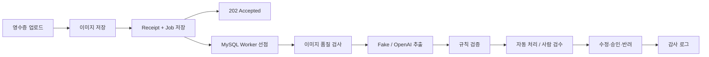

# AI 영수증·경비 검수 시스템

비전 LLM의 추출 결과를 그대로 승인하지 않고, 결정론적 규칙과 사람 검수 안에서 안전하게 사용하는 백엔드 프로젝트입니다. 영수증 업로드와 AI 처리를 비동기로 분리하고 동시 요청, 외부 API 실패, Worker 중단 상황에서도 데이터가 유실되지 않도록 설계했습니다.

## 주요 기능

1. 영수증 접수와 구조화 추출
   - 한국어 카드 영수증 이미지 업로드
   - 상호, 거래일, 총액, 사업자등록번호, 결제수단, 품목 추출
   - OpenAI 또는 API 키가 필요 없는 Fake 추출기 선택

2. 결정론적 검증과 상태 분기
   - 필수 필드, 미래 날짜, 금액, 품목 합계, 사업자등록번호 체크섬 검사
   - 경비 한도, 주말 사용, 금지 업종 정책 검사
   - `AUTO_APPROVED`, `NEEDS_REVIEW`, `NEEDS_RECAPTURE`, `MANUAL_ENTRY`, `UNREADABLE` 분기

3. 사람 검수와 감사 로그
   - 추출 필드 수정 및 승인·반려
   - JPA 낙관적 락을 이용한 동시 수정 충돌 방지
   - 원본 추출값, 수정값, 규칙 결과, 상태 변경 기록

4. 비동기 처리와 장애 복구
   - MySQL 작업 큐와 `FOR UPDATE SKIP LOCKED` 기반 다중 Worker 선점
   - Lease와 Claim Token을 이용한 중단 작업 복구
   - 외부 AI 실패 시 최대 3회 고정 지연 재시도
   - 멱등성 키, 이미지 해시, Redis 분산 락, MySQL Unique Constraint 기반 중복 방지

## 기술 스택

- Backend: Java 17, Spring Boot 3.3, Gradle 8
- Database: MySQL 8.4, Redis 7.2
- AI: OpenAI Responses API
- Test: JUnit 5, Testcontainers
- Infrastructure: Docker Compose

## Challenge

### 동일 이미지 동시 업로드에서 AI 호출이 중복되는 문제

기존에는 중복 이미지 여부를 확정하기 전에 AI를 호출해, 동일 이미지가 동시에 100번 접수되면 영수증은 한 건만 저장되더라도 AI가 최대 100번 호출될 수 있었습니다.

이를 개선해 이미지 해시를 기준으로 중복 요청을 먼저 하나의 추출 작업으로 합치고, Worker가 해당 작업에 대해 AI를 한 번만 호출하도록 변경했습니다. Redis 분산 락으로 동시 요청을 제어하고, MySQL 유니크 키로 중복 저장을 최종 차단했습니다.

### 외부 AI 호출과 DB 저장 사이에서 서버가 종료되는 문제

업로드와 AI 호출을 동기 처리하면 AI 호출 성공 후 DB 저장 전에 서버가 종료될 때 접수 기록은 남지 않고 비용만 발생할 수 있습니다.

업로드 API는 Receipt와 Job을 한 트랜잭션으로 저장하고 `202 Accepted`를 반환합니다. Worker는 Job을 별도로 처리하며, Lease가 만료된 작업은 다른 Worker가 복구합니다. 이전 Worker가 늦게 결과를 반환해도 Claim Token이 다르면 DB에 반영하지 않습니다.

### Redis 락 대기와 Worker Polling 병목

200 VU 부하 테스트에서 처리 완료된 동일 이미지도 Redis 락을 반복해서 기다렸고, Worker는 작업 하나가 끝나도 다음 Polling까지 대기했습니다.

- 처리 완료된 중복 요청은 Redis 락을 건너뛰는 빠른 경로 적용
- Worker 작업 완료 직후 빈 실행 슬롯에 다음 Job 즉시 보충

개선 결과:

| 시나리오 | 개선 전 | 개선 후 |
|---|---:|---:|
| 동일 이미지 처리량 | 573.60 req/s | 1,863.67 req/s |
| 동일 이미지 P95 | 824.38ms | 242.90ms |
| 고유 Job 200건 완료 | 51.237초 | 1.5757초 |

상세 측정 조건과 결과는 [PERFORMANCE_TEST_RESULTS.md](PERFORMANCE_TEST_RESULTS.md)에 기록했습니다.

## Architecture



기술 작업 상태는 `QUEUED → PROCESSING → COMPLETED`로 진행합니다. 추출 실패 시 `RETRY_WAIT`를 거쳐 다시 처리하며, 최대 시도 횟수를 초과하면 Job은 `FAILED`, 영수증은 `MANUAL_ENTRY`로 전환합니다.

## API

| Method | Endpoint | 설명 |
|---|---|---|
| `POST` | `/api/receipts` | 영수증 접수 |
| `GET` | `/api/receipts/{id}` | 영수증과 작업 상태 조회 |
| `PATCH` | `/api/receipts/{id}/fields` | 추출 필드 수정 |
| `POST` | `/api/receipts/{id}/decision` | 승인 또는 반려 |
| `GET` | `/api/receipts/{id}/audit-events` | 감사 로그 조회 |

### 업로드 예시

```bash
curl -i -X POST http://localhost:8080/api/receipts \
  -H 'X-Company-Id: demo-company' \
  -H 'Idempotency-Key: upload-001' \
  -F 'file=@samples/synthetic-receipt.png'
```

최초 요청은 `202 Accepted`와 `receiptId`, `jobId`, `jobStatus=QUEUED`를 반환합니다. 같은 멱등성 키나 동일 이미지는 기존 결과를 반환합니다.

## 실행

필수 조건은 JDK 17과 Docker입니다. 기본 추출기는 외부 API 키가 필요 없는 Fake입니다.

```bash
docker compose up -d --wait mysql redis
./gradlew bootRun
```

MySQL은 로컬 설치 환경과의 충돌을 피하기 위해 호스트의 `3307` 포트를 사용합니다. 애플리케이션은 `http://localhost:8080`에서 실행됩니다.

실제 OpenAI 추출기를 사용하려면 환경변수를 설정합니다.

```bash
export RECEIPT_EXTRACTOR_PROVIDER=openai
export OPENAI_API_KEY=your_key_here
export OPENAI_MODEL=gpt-5.4-mini
export OPENAI_BASE_URL=https://api.openai.com
./gradlew bootRun
```

API 키, 실제 영수증과 개인정보는 저장소에 커밋하지 않습니다. 주요 환경변수는 [.env.example](.env.example)에 정리되어 있습니다.

## 테스트

```bash
./gradlew test
```

주요 테스트 범위:

- 검증 규칙과 상태 라우팅
- Fake/OpenAI 추출 어댑터
- 멱등성 및 동일 이미지 동시 업로드
- 재시도 성공과 최대 시도 초과
- 다중 Worker 작업 분배와 Lease 복구
- 검수자 동시 수정 충돌과 감사 로그
- Testcontainers MySQL·Redis 통합 검증

## 한계

- Redis 장애 시 신규 접수의 MySQL 폴백을 제공하지 않습니다.
- 외부 API의 재시도 가능 오류와 영구 오류를 구분하지 않습니다.
- 회사 경비 정책은 설정 파일 기반이며 인증·권한은 구현하지 않았습니다.
- 로컬 이미지 저장소를 사용하며 흐림·잘림·반사광 검사는 지원하지 않습니다.
- Worker 장애나 처리 지연으로 AI가 중복 호출되더라도, 현재 작업을 맡은 Worker의 결과만 DB에 반영합니다.
