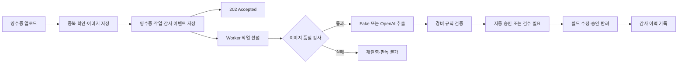

# 사내 영수증·경비 검수 백엔드

직원이 제출한 영수증에서 거래 정보를 추출하고, 경비 규칙 검사와 검수자의 수정·승인·반려를 지원하는 Java/Spring Boot 개인 프로젝트입니다. 한 회사 내부 ERP의 영수증·경비 검수 모듈을 목표로 개발하고 있습니다.

현재는 **이미지 접수, 비동기 추출, 규칙 검증, 개별 영수증 검수 API를 구현한 백엔드 MVP**입니다. 직원 계정·로그인·역할별 권한과 검수 목록·월별 집계는 다음 개발 범위입니다.

## 구현 현황

| 영역 | 현재 상태 |
|---|---|
| 영수증 접수 | 이미지 업로드, SHA-256 중복 확인, 멱등성 키, 접수 후 `202 Accepted` 반환 |
| 정보 추출 | Fake 추출기와 OpenAI 추출 어댑터, 기본 이미지 품질 검사 |
| 경비 규칙 | 필수값·미래 날짜·금액·품목 합계·사업자번호 및 경비 정책 검사 |
| 개별 검수 | 필드 수정, 승인·반려, 낙관적 락, 추출 원본과 수정값·감사 이력 보관 |
| 비동기 작업 | MySQL 작업 큐, Worker 동시 실행 제한, 재시도, 점유 만료 작업 복구 |
| 관측·테스트 | Actuator·Prometheus·Grafana, 단위·통합 테스트, k6 스크립트 |
| 직원 계정·권한 | 개발 예정: 계정 발급, 비밀번호 설정, 로그인, 제출자·검수자 권한 |
| 목록·집계 | 개발 예정: 본인 제출 내역, 검수 대기 목록, 기간·직원·상태 검색, 월별 집계 |

## 주요 설계

- **접수와 추출 분리:** 영수증·추출 작업·멱등성 기록·업로드 감사 이벤트를 하나의 DB 트랜잭션으로 저장하고, 외부 AI 호출은 Worker에서 수행합니다.
- **중복 접수 제어:** 이미지 해시, Redis 잠금, MySQL 유니크 제약을 사용합니다. 이미 중복 감지가 반영된 이미지는 잠금 획득을 생략하고 기존 결과를 반환합니다.
- **작업 선점과 복구:** `FOR UPDATE SKIP LOCKED`로 작업을 분배합니다. 점유 기간인 Lease가 만료되면 작업을 회수하고, Claim Token으로 이전 Worker의 늦은 결과 반영을 차단합니다.
- **검수 충돌 감지:** 영수증의 JPA `@Version`과 요청 버전을 비교해 오래된 데이터로 변경하는 요청을 거부합니다.
- **검수 근거 보관:** AI 추출 원본, 현재 필드값, 규칙별 결과와 변경 이력을 기록합니다.

Claim Token은 오래된 결과의 저장을 방지합니다. Worker 중단·재시도 상황에서 외부 AI 호출이 정확히 한 번만 발생하는 것을 보장하지는 않습니다.

## 처리 구조


```mermaid
flowchart LR
    A[영수증 업로드] --> B[중복 확인·이미지 저장]
    B --> C[영수증·작업·감사 이벤트 저장]
    C --> D[202 Accepted]
    C --> E[Worker 작업 선점]
    E --> F{이미지 품질 검사}
    F -->|통과| G[Fake 또는 OpenAI 추출]
    F -->|실패| H[재촬영·판독 불가]
    G --> I[경비 규칙 검증]
    I --> J[자동 승인 또는 검수 필요]
    J --> K[필드 수정·승인·반려]
    K --> L[감사 이력 기록]
```

작업의 기술적 처리 상태와 영수증의 업무 상태를 구분합니다.

- 작업 상태: `QUEUED`, `PROCESSING`, `RETRY_WAIT`, `COMPLETED`, `FAILED`
- 영수증 상태: `AUTO_APPROVED`, `NEEDS_REVIEW`, `NEEDS_RECAPTURE`, `UNREADABLE`, `MANUAL_ENTRY`, `APPROVED`, `REJECTED`

접수 후 추출이 끝나기 전에는 영수증의 `status`가 `null`이며, `jobStatus`로 진행 상황을 확인합니다. 추출 예외는 최대 3회 시도하고, 최종 실패하면 작업은 `FAILED`, 영수증은 `MANUAL_ENTRY`가 됩니다.

## 기술 스택

| 구분 | 사용 기술 |
|---|---|
| 언어·프레임워크 | Java 17, Spring Boot 3.3.5, Gradle |
| 데이터 저장 | Spring Data JPA, MySQL 8.4, Flyway |
| 중복 요청 잠금 | Redis 7.2, Redisson |
| AI 연동 | OpenAI Responses API, 교체 가능한 `ReceiptExtractor` 인터페이스 |
| 테스트 | JUnit 5, Spring Boot Test, H2, Testcontainers, k6 |
| 실행·관측 | Docker Compose, Actuator, Micrometer, Prometheus, Grafana |

## 패키지 구조

기능을 찾을 때 한 도메인 안에서 요청 처리부터 저장까지 따라갈 수 있도록 도메인별로 패키지를 구성합니다.

```text
src/main/java/com/example/receipt/
├── ReceiptApplication.java
├── domain/
│   ├── receipt/                # 영수증 접수·검수·감사 이력
│   │   ├── controller/
│   │   ├── dto/
│   │   ├── entity/
│   │   ├── exception/
│   │   ├── model/
│   │   ├── repository/
│   │   ├── service/
│   │   └── validation/
│   └── extraction/             # 추출 작업 선점·실행·재시도·복구
│       ├── config/
│       ├── dto/
│       ├── entity/
│       ├── exception/
│       ├── extractor/
│       ├── model/
│       ├── quality/
│       ├── repository/
│       └── service/
└── global/                     # 공통 설정과 인프라
    ├── config/
    ├── exception/
    ├── lock/
    ├── observability/
    └── storage/
```

각 도메인에는 필요한 계층을 둡니다. `dto`는 API·서비스 간 전달 데이터를, `model`은 상태·값 객체를 담습니다. 테스트도 같은 도메인 구조를 따르며, 여러 도메인을 함께 검증하는 MySQL 통합 테스트는 테스트 루트에 둡니다. 직원 계정 기능을 추가할 때도 `domain/employee/` 아래에 필요한 `controller`, `dto`, `service`, `entity`, `repository`를 구성할 계획입니다.

## 로컬 실행

JDK 17과 Docker Compose를 준비하고, 아래 명령을 **프로젝트 루트**에서 실행합니다.

```bash
docker compose up -d --wait mysql redis
./gradlew bootRun
```

기본 연결 주소는 애플리케이션 `http://localhost:8080`, MySQL `localhost:3307`, Redis `localhost:6379`입니다. 원본 이미지는 기본적으로 `runtime/receipt-images/`에 저장합니다.

기본 `fake` 추출기는 외부 API 키 없이 처리 흐름을 확인하기 위한 테스트용 구현입니다. 실제 이미지의 글자를 인식하지 않고 정해진 데이터를 반환합니다.

### 영수증 접수와 조회

```bash
curl -i -X POST http://localhost:8080/api/receipts \
  -H 'X-Company-Id: demo-company' \
  -H 'Idempotency-Key: upload-001' \
  -F 'file=@samples/synthetic-receipt.png;type=image/png'
```

신규 접수 응답에는 `receiptId`, `jobId`, `jobStatus`, `acceptedAt`이 포함됩니다. 아래 `1`을 응답의 `receiptId`로 바꿔 조회합니다.

```bash
curl http://localhost:8080/api/receipts/1
```

현재 업로드 API는 `X-Company-Id`를 요구합니다. 이 값은 기존 데이터 구분을 위한 입력값이며 인증이나 접근 권한 검사를 대신하지 않습니다. 한 회사 내부 사용을 위한 직원 계정·영수증 소유자 연결은 개발 예정입니다.

### 실제 AI 추출 사용

실행할 셸 또는 IDE에 아래 환경변수를 설정합니다. API 키와 모델 ID는 사용하는 계정에 맞게 입력합니다.

```bash
export RECEIPT_EXTRACTOR_PROVIDER=openai
export OPENAI_API_KEY='<API 키>'
export OPENAI_MODEL='<사용할 모델 ID>'
export OPENAI_BASE_URL='https://api.openai.com'
./gradlew bootRun
```

현재 설정에서는 모델과 URL의 환경변수 미지정 값이 빈 문자열이므로 둘 다 명시해야 합니다. 전체 환경변수 목록은 [.env.example](.env.example)을 참고하고, 실행 프로세스에 필요한 값을 전달합니다.

## 현재 API

| Method | Endpoint | 기능 |
|---|---|---|
| `POST` | `/api/receipts` | 이미지 접수. 신규 요청은 `202`, 기존 결과 반환은 `200` |
| `GET` | `/api/receipts/{id}` | 영수증 데이터·검증 결과·작업 상태 조회 |
| `PATCH` | `/api/receipts/{id}/fields` | 추출 필드 수정과 규칙 재검증 |
| `POST` | `/api/receipts/{id}/decision` | `APPROVE` 또는 `REJECT` 결정 |
| `GET` | `/api/receipts/{id}/audit-events` | 감사 이력 조회 |

수정·결정 요청은 최신 `version`을 전달해야 하며 버전 충돌은 `409 Conflict`로 반환합니다. 현재 `reviewerId`는 요청 본문으로 받습니다. 인증 도입 시 로그인한 사용자 정보로 검수자를 결정하도록 변경할 계획입니다.

## 다음 개발 및 검증 계획

아래 항목은 **개발·측정 예정**이며, 완료된 기능이나 성능 성과가 아닙니다.

### 1. 직원 계정과 사용 권한

- 관리자 계정 발급, 직원 비밀번호 설정 및 로그인
- 로그인한 직원과 제출 영수증 연결, 본인 내역 접근 제한
- 담당 검수자의 조회·수정·승인·반려 권한
- 실제 작업자 신원을 기준으로 감사 이력 기록

### 2. 승인·동시 검수의 정합성

- 필수 데이터 누락 시 승인을 차단하는 조건 정의
- 필드 수정과 중복 제출 후에도 품질 상태·중복 판정이 유지되도록 보완
- 같은 버전으로 수정·승인이 동시에 요청될 때 결과와 충돌 응답 검증
- 변경 실패 시 업무 데이터와 감사 이력의 부분 저장 여부 검증

검증 시나리오와 요청 수를 명시하고, 잘못 허용된 승인 건수, 변경 성공·충돌 건수, 데이터·감사 이력 불일치 건수를 기록합니다.

### 3. 검수 목록·경비 집계의 조회 성능

- 본인 제출 내역, 검수 대기 목록과 기간·직원·상태별 검색 구현
- 월별 승인 금액 집계 구현
- 테스트 데이터 규모와 부하 조건을 고정하고 쿼리 실행계획으로 병목 확인
- 필요한 쿼리·인덱스·페이지네이션 개선 후 동일 조건으로 재측정

조회 응답시간 p95, 쿼리 실행시간, 읽은 행 수와 오류율을 비교하고 결과의 정확성도 함께 검증합니다. 접수 응답시간과 추출 완료시간은 별도 지표로 다룹니다.

## 테스트와 관측

```bash
./gradlew test
```

규칙 검증, API, 동시 업로드, 재시도, Worker 처리와 검수 버전 충돌을 테스트합니다. MySQL·Redis 통합 테스트는 Testcontainers로 실행하며, Docker가 없으면 해당 테스트는 건너뜁니다.

- [자동화 테스트](src/test/java/com/example/receipt/): 규칙·API·작업 처리 테스트
- [부하 테스트](load/): 동일 이미지 반복 요청과 고유 이미지 접수용 k6 스크립트
- [관측 설정](monitoring/): Prometheus 수집 및 Grafana 대시보드

현재 k6 스크립트와 과거 성능 기록은 업로드·Worker 처리 검증용입니다. 새로 계획한 직원별 검수 목록·집계 성능의 측정 결과는 아직 없습니다.

## 현재 제한과 우선 보완 사항

- 필수 데이터가 없는 영수증의 승인과, 중복 제출·수정에 따른 상태·중복 판정 변경 경로를 보완해야 합니다.
- 같은 멱등성 키에 다른 파일을 보내는 경우와 중복 이미지에 새 키를 붙이는 경우의 요청 계약을 보완해야 합니다.
- 추출 오류 유형별 재시도 구분과 Lease 만료 복구의 전체 시도 상한이 없습니다.
- 이미지는 로컬 파일로 저장하며, 품질 검사는 디코딩 가능 여부와 최소 해상도를 기준으로 합니다.

## 관련 문서

| 문서 | 내용 |
|---|---|
| [클라우드 실행 준비](docs/CLOUD_TASK.md) | Your dot·Codex Cloud 환경 요구사항, 직원 계정·인증·접근 권한 구현 범위와 검증 기준 |
| [기존 README](docs/README_LEGACY.md) | 문서 재정리 이전의 프로젝트 설명과 설계 기록 |
| [기존 성능·부하 테스트 기록](docs/PERFORMANCE_TEST_RESULTS.md) | Fake 추출기·합성 이미지 환경에서 기록한 업로드·Worker 전후 비교 |
| [기존 프로젝트 진단](docs/PROJECT_REVIEW.md) | 2026-09-28 기준 코드 검토와 개선 제안 |

기존 문서는 당시의 구현·검토·측정 기록으로 보관합니다. 현재 개발 방향은 이 README를 기준으로 하며, 과거 Fake 환경의 성능 수치를 실제 AI 추출 성능으로 해석하지 않습니다.
